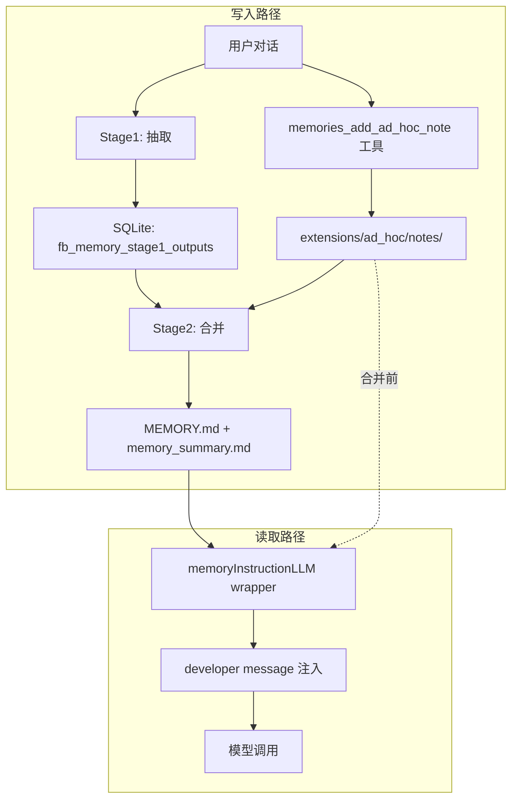

# Memory 原理与机制

本文基于 Forebrain Harness 源码分析，系统阐述 Forebrain Harness memory 的隔离维度、写入机制、读取注入机制、LLM Provider 兼容性，以及一个完整的场景示例。适合需要深入理解 memory 内部行为的开发者阅读。

如果你只需要产品层面的概览，请先阅读 [Memory Systems](/guide/memory-systems)。

::: tip 双语版本
[English version](/guide/memory-internals)
:::

## 架构总览



Forebrain Harness memory 由以下核心组件构成：

| 组件 | 所在包 | 职责 |
|------|--------|------|
| `Store` | `internal/memories` | 绑定单个 primary agent，所有读写以 `agent_id` 过滤 |
| `Pipeline` | `internal/memories` | 后台异步执行 Stage1 抽取 + Stage2 合并 |
| `memoryInstructionLLM` | `internal/agentrun` | LLM wrapper，每次模型调用时注入 turn instruction：memory_summary、尚未合并的 note、以及记录新记忆的规则 |
| dedicated memory tools | `internal/codetools` | `memories_list` / `memories_read` / `memories_search` / `memories_add_ad_hoc_note` |
| `localbackend.Backend` | `internal/memories/localbackend` | memory 文件系统的读写后端 |

## 隔离维度：Tenant，不是 Project

### 核心结论

Forebrain Harness memory 的唯一隔离边界是 **Tenant（primary agent / agentID）**，**不存在 project 维度的 memory 机制**。

### 证据

`Store` 绑定到单个 `agentID`，所有 SQL 查询都以 `agent_id=?` 作为过滤条件：

- **抽取** — `ClaimStage1JobsForStartup`（`jobs.go:102`）:
  ```sql
  WHERE agent_id=? AND memory_mode=? AND id<>? AND memory_source IN (?,?) AND updated_at>=? AND updated_at<=?
  ```
- **合并选择** — `SelectStage1ForPhase2`（`store.go:235`）:
  ```sql
  WHERE o.agent_id=? AND s.agent_id=? AND s.memory_mode=?
  ```
- **写入/删除/用量更新** — `UpsertStage1Output`、`DeleteThreadMemory`、`UpdateUsage` 全部 `agent_id=?`

合并 job 的 key 也是 tenant 本身：`consolidateJobKey(agentID) = agentID`（`jobs.go:43`）。

### memory 文件根 = per-tenant workspace root

```
ResolveRootForAgent(workspaceRoot) → <workspaceRoot>/memories/   (root.go:28)
```

- `workspaceRoot()`（`runner.go:1424`）= `r.WorkspaceRoot` 或 `~/.forebrain/workspace`，是 per-agent 的
- `MEMORY.md` / `memory_summary.md` 存在 per-tenant 目录下，**路径中没有 project key**

### `memories/project.go` 的函数服务其他子系统

`project.go` 定义了 `ProjectKey()` / `ProjectRoot()` / `GitBranch()`，但它们**不用于 memory store 的隔离/过滤**：

| 函数 | 真实用途 | 调用方 |
|------|---------|--------|
| `ProjectKey()` | plan 文件目录 `planstore.PlanDirForProject`、subagent 继承 | `clifacade/chat_session.go`、`workerhost/open.go` |
| `ProjectRoot()` | 文件工具默认路径、权限 | `clifacade/chat_session.go` |
| `GitBranch()` | 写入 `fb_sessions.git_branch` 列（会话元数据） | `clifacade`、`workerhost` |

`Store` 内部从不调用这些函数。

### Cwd / GitBranch 只是描述性元数据

`Stage1Output` 和 `SessionCandidate` 结构体中有 `Cwd`、`GitBranch` 字段，但它们：

1. 只被 SELECT 出来作为元数据
2. 写入 rollout summary 文件头部（`storage.go:78-84`）和 evidence JSONL（`evidence.go:30-34`）
3. **从未出现在任何 WHERE 子句中** — 不用于抽取/合并/读取的过滤

### 隔离测试验证

`tenant_isolation_test.go` 明确验证：两个 agent 共享同一个 SQLite DB，完全靠 `agent_id` 过滤实现隔离，project 不参与。

## 写入机制

memory 的写入有两条路径，最终汇合到同一份 `MEMORY.md`。

### 路径一：ad-hoc note（即时写入）

两种情况下 agent 会调用 `memories_add_ad_hoc_note` 工具：用户明确要求"记住…"，或者用户消息本身给出了一条应当长期生效的规则、约束或偏好（见下面的[主动记录](#主动记录)）：

```
memories_add_ad_hoc_note
  → backend.AddAdHocNote(filename, note)                    (memory_tools.go:61)
  → 写入 <workspaceRoot>/memories/extensions/ad_hoc/notes/<timestamp>-<slug>.md
```

- 默认 `DedicatedTools=true`（`config.go:368`），工具默认注册
- 写入需要工具审批，用户在存盘前会看到 note 全文（`permissions/engine.go`：memory 读工具是 `safe_readonly_default_allow`，写工具不是）
- 写入是**即时的**，但 note 只在 extensions 目录，**不在 `MEMORY.md` 中**——只有合并流程才会更新 `MEMORY.md`
- 在被合并之前，note 由 turn instruction 的 pending-notes 段落注入到每一次模型调用（`instruction.go: renderPendingNotesSection`），所以刚刚记下的规则在下一个会话就已生效，不必等待数小时后的 Phase 2

#### 主动记录

turn instruction 的 `capture.md` 部分（只要 `generate_memories` 打开就会渲染）要求 agent 在每次回复前检查：用户这条消息是否给出了一条 **applicable**（会改变以后会话的做法，且来自用户）、**durable**（判据是用户把这条指令的作用域说得多宽，与具体用词和语言无关：绝对化表述、禁令、"每次都…"放大作用域，"这里"、"暂时"、"就这一次"收窄）、**legible**（规则连同理由，脱离上下文也能读懂）的经验。符合条件就必须在同一条回复里写入 note。与读取部分不同，这一段在 memory 目录为空时同样渲染——否则新工作区里用户说的第一条规则永远无法被记录。

写入段只在可能承载用户发言的 run 中渲染：子 agent（`agent:*` query source）、压缩、hook run 会被排除（`memoryCaptureAllowedForSource`），因为它们的"用户消息"其实是别的 agent 写的提示词，在那里记录只会把任务文本当成用户的长期规则存下来。

#### 哪些 note 还没被合并

一次合并流程处理的是它启动时快照的 workspace diff。这个时间点记录在 `<stateRoot>/memory-consolidated-at`（`markConsolidationStart`），两处会读它：

- `renderPendingNotesSection` 注入修改时间晚于它的 note（按时间倒序，最多 20 条 / 1200 token），取值时点为该会话的第一次模型调用
- `resetGitBaseline` 把修改时间晚于它的 extension 文件**排除**在新 baseline commit 之外，因此在合并运行期间记下的 note 会出现在下一次合并的 diff 里，而不会被埋进 baseline

### 路径二：自动抽取 + 合并（异步 pipeline）

#### 触发时机

每次根交互回合结束后，`maybeLaunchMemoryStartup`（`supervisorrun/run.go:186`）触发 `Pipeline.Run`：

```go
func maybeLaunchMemoryStartup(o Options, sessionID string) {
    if o.Runner == nil { return }
    if strings.TrimSpace(o.ParentRunID) != "" { return }   // 子 agent 不触发
    if !isRootInteractiveSource(querySourceForRun(o)) { return }
    o.Runner.LaunchMemoryStartup(sessionID)
}
```

#### Stage1：抽取

`ClaimStage1JobsForStartup` 从 `fb_sessions` 表中选择符合条件的会话：

- `agent_id=?` — 当前 tenant
- `memory_mode=enabled` — 会话开启了 memory
- `memory_source IN ('tui','webchat')` — 来自交互界面
- `updated_at >= now - MaxRolloutAgeDays` （默认 10 天）
- `updated_at <= now - MinRolloutIdleHours` （默认 **6 小时**空闲）

::: warning 6 小时空闲门槛
当前会话不到 6 小时空闲不会被抽取。这意味着用户刚说完"记住..."，这段对话不会被立即抽取为 raw memory，需要等会话空闲 6 小时后才会进入 Stage1。
:::

Stage1 用 ExtractLLM 从对话 transcript 中提取结构化 JSON（`raw_memory` / `rollout_summary` / `rollout_slug`），脱敏后写入 `fb_memory_stage1_outputs` 表。

#### Stage2：合并

`runStage2`（`pipeline.go:292`）**无论 Stage1 有无产出都会运行**：

1. `TryClaimGlobalPhase2` 抢合并锁（有 6 小时 cooldown）
2. `SelectStage1ForPhase2` 选出当前 tenant 的所有 stage1 输出
3. `syncPhase2WorkspaceInputs` 将输出同步到 memories 目录（`raw_memories.md` + `rollout_summaries/`）
4. `memoryWorkspaceDiff` 计算 memories 目录的 git diff
5. 若 `changed=true` → 合并 LLM 运行，读 workspace diff + ad-hoc notes，合并进 `MEMORY.md` + `memory_summary.md`
6. `validateConsolidationArtifacts` 验证产物（`MEMORY.md` 存在、`memory_summary.md` 首行为 `v1`）

::: tip ad-hoc note 的合并
ad-hoc note 作为新增文件出现在 git diff 中。合并 LLM 按 `ad_hoc_instructions.md` 的指示将 note 内容合并进 `MEMORY.md` 和 `memory_summary.md`。ad_hoc_instructions.md 声明："Every note must be consolidated in the memory structure."
:::

## 读取与注入机制

### 核心结论：MEMORY.md 从不直接注入

被自动注入的是 `memory_summary.md`（独立的索引/摘要文件），不是 `MEMORY.md`。`MEMORY.md` 只在注入的模板文本中被**提及**，agent 需要主动检索。

### 注入链路

**安装时机** — `loadLocked()`（`runner.go:729`）构建 LLM client chain：

```go
llmClient = wrapMemoryInstructionLLM(llmClient, r.workspaceRoot(), r.AppCfg)
```

触发场景：runner 初始化、config hot-reload、`/model` 切换。

**执行时机** — 每次 LLM `Execute` 调用（即每个 turn 的每次模型调用）：

```go
func (w *memoryInstructionLLM) Execute(ctx, messages, tools) {
    opts := memories.InstructionOptionsFromConfig(w.cfg)
    opts.Capture = opts.Capture && memoryCaptureAllowedForSource(QuerySourceFromContext(ctx))
    // 每个会话只渲染一次，之后逐字节返回同一份
    instruction := w.instructionForSession(codetools.AgentSessionIDFromContext(ctx), opts)
    if instruction != "" {
        messages = memories.InjectDeveloperInstruction(messages, instruction)
    }
    return w.inner.Execute(ctx, messages, tools)
}
```

`InstructionOptions` 有两个互相独立的部分，各自跟随自己的开关：`Recall`（`use_memories`）渲染已存储的记忆和使用规则，`Capture`（`generate_memories`）渲染写入新记忆的规则。只有两者都关闭时，wrapper 才完全不安装。

**按会话冻结** — instruction 在该会话第一次模型调用时渲染，之后该会话的每次调用都拿到逐字节相同的那一份，缓存键是 session id + 渲染选项。

这是 prompt cache 的硬性要求，不是优化。这条消息位于整段对话之前，只有它逐字节不变，provider 才会命中前缀缓存；如果每次调用都重新读 `memory_summary.md` 和 notes 目录，那么一旦记下一条 note 或一次合并落地，这条消息就会变化，从而让 system prompt、工具定义和之前所有轮次的缓存全部失效。这样做也不损失什么：会话中途记下的 note 本来就在该会话的 transcript 里，下一个会话会重新渲染。

### 注入内容生成

```
RenderTurnInstruction(root, opts)                      (instruction.go)
  ├─ Recall：<workspaceRoot>/memories/memory_summary.md
  │    → os.ReadFile、TrimSpace，空则跳过该段
  │    → truncateTextToTokenBudget(content, 2500)       ← 截断到 2500 token
  │    → renderTemplate(readPathInstruction, {base_path, memory_summary, tool_guidance})
  ├─ Recall：extensions/ad_hoc/notes/ 中晚于合并标记的 note
  │    → 按时间倒序，最多 20 条 / 1200 token
  │    → renderTemplate(pendingNotesInstruction, {pending_notes})
  └─ Capture：renderTemplate(captureInstruction, {base_path, note_write_guidance})
  → 拼接后 InjectDeveloperInstruction
```

`renderTemplate` 是简单的 `strings.ReplaceAll`：把模板全文中的 `{{ base_path }}`、`{{ memory_summary }}` 等占位符替换为实际值，**模板其余所有文本原样保留**。

最终注入的消息结构：

```
[System message]
[Developer message: 读取段 + 未合并 note + 写入段]   ← 这里
[User/Assistant 消息...]
```

### turn instruction 模板内容

模板全文都会注入，包含：

| 模板 | 部分 | 说明 |
|------|------|------|
| `read_path.md` | 决策边界 | "Skip memory ONLY when..." 何时使用 memory |
| `read_path.md` | Memory layout | 列出 memory_summary.md / MEMORY.md / skills/ / rollout_summaries/ 的结构 |
| `read_path.md` | Quick memory pass | 5 步检索流程指导 |
| `read_path.md` | Citation 要求 | `<oai-mem-citation>` 格式规范 |
| `read_path.md` | `{{ memory_summary }}` | 替换为 memory_summary.md 截断到 2500 token 的全文 |
| `pending_notes.md` | `{{ pending_notes }}` | 上次合并之后记下的 note 全文 |
| `capture.md` | 写入规则 | applicable / durable / legible 判据、同一条回复内写入、什么绝不写入 |
| `capture.md` | `{{ note_write_guidance }}` | `memories_add_ad_hoc_note` 用法；工具关闭时给出 notes 目录路径 |
| 全部 | `{{ base_path }}` | 替换为实际路径，如 `~/.forebrain/workspace/memories` |

### 已存储记忆进入 turn 的几种路径

| 方式 | 机制 | 自动？ |
|------|------|--------|
| `memory_summary.md` 注入 | developer message，每次 LLM 调用 | ✅ 自动 |
| 未合并 ad-hoc note 注入 | developer message，从下一个会话起直到被合并 | ✅ 自动 |
| read_path 模板引导搜索 | 模板文本引导 agent "去搜 MEMORY.md" | ❌ 依赖 LLM 主动执行 |
| dedicated tools | `memories_search` / `memories_read` / `memories_list` | ❌ 依赖 LLM 主动调用 |

### 注入前置条件

1. 至少一个部分开启（构造时检查）
   - Recall：`features.memories=true` **且** `memories.use_memories=true`
   - Capture：`features.memories=true` **且** `memories.generate_memories=true`
   - 三个开关默认都为 true
2. 读取段还要求 `memory_summary.md` 存在且非空（运行时检查）；pending-notes 段要求至少有一条未合并的 note；写入段没有运行时前置条件——它在空工作区里同样渲染，因为第一条规则正是在那里被记录的
3. 每次 Execute 都重新检查

## LLM Provider 兼容性

注入的 developer message 的 role 是 **`developer`**（`llm.RoleDeveloper = "developer"`，`llm.go:260`）。

源码注释规定：不支持 developer role 的 provider 必须映射到最接近的指令 role。

| Provider | 发给 API 的 role | 源码位置 |
|----------|-----------------|----------|
| OpenAI Responses API | `developer`（原生支持） | `openai_responses_llm.go:649-654` |
| OpenAI-compatible（DeepSeek 等） | **降级为 `system`** | `openai_compat_llm.go:1075-1081` |
| Anthropic | **合并进 system parts** | `anthropic_agent_llm.go:194` |

不支持 `developer` role 的 provider 全部降级为 `system` role 发送，内容不会丢失。

## 场景示例：Project A 的"不要生成单元测试"记忆

### 场景描述

用户在 Java 项目 Project A 的根路径下启动 Forebrain Harness TUI，要求 primary agent 记住"Project A 不要生成单元测试代码"。

### 记到哪里？

记忆存储在 **agent（tenant）级别的 workspace 目录**，不是 project 级别：

```
<workspaceRoot>/memories/
```

其中 `<workspaceRoot>` = `rt.StateRoot()` = agent 的 workspace root（通常 `~/.forebrain/workspace`），**与用户启动 TUI 时的 Project A 路径无关**。

### 写入时序

```
1. 用户："记住 Project A 不要生成单元测试"——或者只是在提别的需求时
   把它作为一条长期规则说出来
   → agent 调用 memories_add_ad_hoc_note（用户在审批时看到 note 全文）
   → note 即时写入 <workspaceRoot>/memories/extensions/ad_hoc/notes/<timestamp>-<slug>.md
   （此时 note 还不在 MEMORY.md 中）

2. 本会话剩余回合：note 就在 transcript 里，规则已经生效，不需要再注入
   （注入的 instruction 按会话冻结，以保住 prompt cache）

   之后的每个会话：memoryInstructionLLM.Execute 发现该 note 晚于合并标记，
   把它注入该会话的 instruction

3. 当前回合结束 → maybeLaunchMemoryStartup → Pipeline.Run
   → Stage1: MinRolloutIdleHours=6，当前会话不够空闲，不会被抽取
   → Stage2: runStage2 运行（若 6h cooldown 已过）
     → memoryWorkspaceDiff 检测到 ad-hoc note 为新增文件
     → 合并 LLM 运行，将 note 合并进 MEMORY.md + memory_summary.md
     → 合并标记前移，该 note 不再单独注入

4. 之后的回合
   → memoryInstructionLLM.Execute 从磁盘读 memory_summary.md
   → 注入为 developer message
   → agent 看到记忆，在开发时遵循
```

### 是否能真实生效？

**能生效**，但有延迟和限制：

| 限制 | 原因 | 源码 |
|------|------|------|
| ad-hoc note 不会立即出现在 memory_summary.md | 只有合并流程会写那个文件；在此之前 note 以 pending note 的形式注入 | `instruction.go: renderPendingNotesSection` |
| 合并有 6 小时 cooldown | `phase2CooldownSeconds = 6*60*60` | `jobs.go:29` |
| 合并是异步后台运行 | `LaunchAsync` 起 goroutine，可能失败 | `pipeline.go:39-52` |

### 开发 Project A 时能否正常召回？

**合并完成后能召回**：

- `memory_summary.md` 每回合自动注入系统提示（截断到 2500 token）
- read_path.md 模板引导 agent 搜索 `MEMORY.md` 中的关键词
- agent 可用 `memories_search` / `memories_read` 主动检索

### 跨项目泄露问题

::: warning 不是 project 维度隔离
记忆存储在 agent（tenant）级 `<workspaceRoot>/memories/`，同一 agent 开发 Project B 时**也会看到**"Project A 不要生成单元测试"这条记忆。系统层面不做任何 project 过滤，是否只对 Project A 生效完全依赖 LLM 从记忆文本中的"Project A"自行推断。
:::

## 配置参数

所有 memory 配置项默认开启，可通过 YAML 配置调整：

```yaml
features:
  memories: true              # memory 总开关

memories:
  use_memories: true          # 读取路径开关
  generate_memories: true     # 生成（抽取）开关
  dedicated_tools: true       # dedicated memory tools 开关
  max_unused_days: 30         # stage1 输出最大未使用天数（超期清理）
  max_rollout_age_days: 10    # 抽取的最大会话年龄（天）
  max_rollouts_per_startup: 2 # 每次启动最多抽取的会话数
  min_rollout_idle_hours: 6   # 会话空闲多少小时后才抽取
  min_rate_limit_remaining_percent: 25  # 速率限制最低剩余百分比
```

源码位置：`internal/config/config.go:331-374`

## memory 产物文件结构

```
<workspaceRoot>/memories/
├── memory_summary.md          # 自动注入的摘要索引，首行必须为 v1
├── MEMORY.md                  # 记忆手册，agent 主动检索的主文件
├── raw_memories.md            # Stage1 合并的原始记忆（临时文件，Phase2 输入）
├── rollout_summaries/         # 每个会话的摘要回顾
│   └── <timestamp>-<hash>-<slug>.md
├── skills/                    # 可复用技能
│   └── <skill-name>/
│       └── SKILL.md
├── extensions/
│   └── ad_hoc/
│       ├── instructions.md    # ad-hoc note 合并指引
│       └── notes/             # 已记录的记忆（合并前逐回合注入）
│           └── <timestamp>-<slug>.md
└── phase2_workspace_diff.md   # Phase2 用的 git diff（临时，非持久产物）
```

## 局限性与注意事项

1. **无 project 维度隔离** — memory 按 tenant 隔离，同一 agent 的所有项目记忆混在同一份 `MEMORY.md` 中。跨项目约束可能互相干扰。

2. **合并延迟** — ad-hoc note 写入后立即生效（未合并的 note 会注入每个回合），但要进入 `MEMORY.md` 和 `memory_summary.md` 必须等合并周期，最坏情况下要等 6 小时 cooldown 过后。在此之前它无法被 `memories_search` 检索到，也不会与既有记忆做去重。

3. **依赖 LLM 判断** — memory 的抽取、合并、检索都依赖 LLM 的判断能力。低能力模型可能抽取不到高信号记忆，或在检索时遗漏相关内容。

4. **memory_summary.md 截断** — 注入时截断到 2500 token。如果摘要过长，中间部分会被截断（`MiddleTokens` 策略），可能丢失关键内容。

5. **MEMORY.md 不自动注入** — 只有 `memory_summary.md` 自动注入。`MEMORY.md` 的内容需要 agent 主动通过工具或文件搜索读取。

## 相关文档

- [Memory Systems](/guide/memory-systems) — 产品层面的 memory 概览
- [Context and Compaction](/guide/context-and-compaction) — 会话连续性与压缩机制
- [Memory, Compaction, And Runtime Features](/config/memory-and-runtime-features) — 配置参考
- [Architecture](/guide/architecture) — 整体架构
