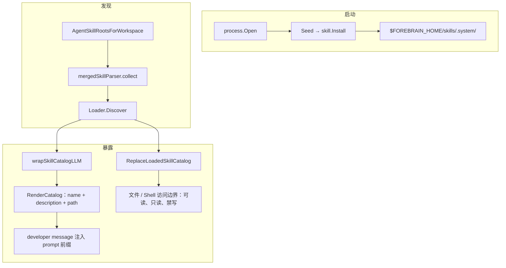

# Skill 加载机制

本文基于 Forebrain Harness 源码，说明 Forebrain Harness 如何加载 skill：skill 在 Forebrain Harness 中的文件约定、从哪些路径加载、加载顺序与优先级、发现与解析规则，以及最终如何暴露给 LLM。适合需要理解 skill 内部行为的开发者与贡献者阅读。

## 核心结论

Forebrain Harness 的 skill 加载是「**根目录集合解析 + 会话级目录注入**」：

1. 按固定的优先级顺序扫描一组 skill 根目录，找出其中包含 `SKILL.md` 的子目录；
2. 把每个被启用的 skill 渲染成「名称 + 描述 + 路径」的目录（catalog）；
3. 通过 LLM wrapper 把这份 catalog 作为 developer 指令注入 prompt 前缀，**每个会话只渲染并冻结一次**；
4. skill 正文不进入 prompt，由模型按需用文件工具读取 `SKILL.md`；只有用户显式通过斜杠命令调用时，正文才会被内联注入。



## Skill 的文件约定

Forebrain Harness 对一个 skill 的最小要求是：某个 skill 根目录下的一个子目录，包含一个 `SKILL.md` 文件：

```text
<skill-root>/<skill-name>/SKILL.md
```

`SKILL.md` 由两部分组成（`pkg/skill/skill.go`）：

- 文件必须**以 `---` 分隔的 YAML frontmatter 开头**，之后是 Markdown 正文；
- 解析器用 `strings.SplitN(content, "---", 3)` 拆分：第一段之后是 YAML，再之后是正文。

frontmatter 支持的字段（`pkg/skill/skill.go:45-60`）：

| 字段 | 说明 |
|------|------|
| `name` | skill 名称 |
| `description` | 目录中展示给模型的描述（必填，缺省则该 skill 不进入目录） |
| `license` | 许可证 |
| `compatibility` | 兼容性说明 |
| `metadata` | 任意附加元数据 |
| `allowed-tools` | 允许使用的工具说明 |
| `slash-command` | `*bool`，缺省为 `true`，表示自动派生同名斜杠命令；设为 `false` 则不派生 |

## 加载路径与优先级

路径解析的唯一入口是 `skill.AgentSkillRootsForWorkspace(home, workspaceRoot)`（`pkg/skill/roots.go:58-79`），被 `pkg/run/runner.go:789` 与 `:1040` 调用。它按优先级从高到低返回以下根目录：

| 优先级 | 路径 | 说明 |
|--------|------|------|
| 1 | `<项目根>/.forebrain/skills`、`.agents/skills`、`.claude/skills`、`.codex/skills` | 可信的项目技能目录，带信任门禁 |
| 2 | `<workspaceRoot>/skills` | 当前 agent 工作区技能 |
| 3 | `$FOREBRAIN_HOME/skills` | 用户 / 全局安装的技能 |
| 4 | `~/.agents/skills`、`~/.claude/skills`、`~/.codex/skills` | 跨工具的用户级技能目录 |
| 5 | `$FOREBRAIN_HOME/skills/.system` | 内嵌的系统技能，最低优先级 |

`AgentSkillRoots(home)` 是 `AgentSkillRootsForWorkspace(home, <home>/workspace)` 的便捷封装。

### 项目技能目录的信任门禁

优先级最高的项目目录不是无条件加载的（`pkg/skill/roots.go:100-118`）。要进入模型提示，必须同时满足：

1. 当前进程目录位于版本控制项目内——`safety.Resolve(cwd)` 发现 `.git` 目录或 worktree 式 `.git` 文件，返回 `VersionControlled=true`（`pkg/safety/engine.go:930-958`）；
2. 该项目存在已持久化的「可信」决策——`safety.IsTrusted(home, project)` 返回 `true`。未判定或显式拒绝都视为不可信，fail-closed（`pkg/safety/engine.go:965-971`）。

这是防御性设计：项目目录里随 checkout 一起到达的 skill 本质是指令、常常还带脚本，只有用户明确信任该项目，它们才会被描述给模型。

### 同名遮蔽

同名 skill 由更高优先级的根遮蔽低优先级副本：扫描时先到先得，命中过的目录名或 skill 名不再重复收录（见下文发现规则）。

> 管理视图（`pkg/skill/hub.go` 的 `Hub`）使用相同的根顺序，但项目目录**不经过信任门禁**。那是给人做 list / inspect / toggle 用的；能否进入模型提示仍由 `TrustedProjectSkillRoots` 决定。

## 发现与解析

`skill.Loader{ Roots, StateRoot }.Discover()`（`pkg/skill/skillrt.go:63-87`）通过 `mergedSkillParser.collect()` 遍历各根目录：

1. 遍历每个根的直接子目录。**depth 0 时**若子目录内没有 `SKILL.md`，会再递归一层（depth+1），用于支持 `.system/caveman/*` 这类命名空间容器；更深的层级不再递归（`skillrt.go:137-161`）。
2. 跳过以 `.` 开头的隐藏目录，唯独放行 `.system`。
3. `SKILL.md` 读不到、为空或解析失败 → 跳过；`description` 为空 → 跳过（无描述的 skill 不会出现在目录中）。
4. 按规范化路径（`CanonicalSkillPath`：绝对路径 + 符号链接解析，`roots.go:199-225`）过滤被禁用的 skill。禁用状态存于 `<workspaceRoot>/state/skills/disabled.json`（`pkg/skill/state.go:41-43`）。
5. 去重：`seenDirs`（按相对路径，大小写不敏感）与 `seenNames`（按 skill 名，大小写不敏感）保证先扫描的根胜出，即高优先级遮蔽低优先级。
6. 排序：按 skill 名小写排序；`CatalogEntries` 再以路径做 tie-break，保证同一 skill 集合每次渲染字节一致（`pkg/skill/catalog.go:94-120`）。

## 如何暴露给 LLM

### 主机制：会话前缀注入 + progressive disclosure

在 `pkg/run/runner.go:789`，LLM 客户端被包装：

```go
llmClient = wrapSkillCatalogLLM(llmClient,
    skill.AgentSkillRootsForWorkspace(r.Home, r.workspaceRoot()),
    r.workspaceRoot())
```

`skillCatalogLLM`（`pkg/run/skills.go:19-94`）在每次 `Execute` 前：

- 调用 `catalogForSession(sessionID)` 渲染目录，**每个会话只渲染一次**，之后逐字节复用缓存（`bySession` map + mutex）；
- 把渲染结果经 `memory.InjectDeveloperInstruction(messages, catalog)` 注入为一条 `role=developer`、`IsMeta=true` 的消息；若已存在 `system` 消息则插到 system 之后，否则置于消息序列最前（`pkg/memory/instruction.go:334-346`）。

目录内容由 `RenderCatalog` 生成（`pkg/skill/catalog.go:49-76`），结构为：

- `## Skills` + 一段说明；
- `### Available skills`：每行 `- name: description (path)`，其中 `path` 指向该 skill 的 `SKILL.md` 绝对路径；
- `### How to use skills`：一段 progressive disclosure 协议，要求模型先判断 skill 是否适用，然后**自己用文件工具完整读取对应 `SKILL.md`**，相对路径相对 `SKILL.md` 所在目录解析，`scripts/`、`assets/`、`references/` 按需读取，且 skill 不跨轮次携带。

关键点：**catalog 只包含「名称 + 描述 + 路径」，skill 正文不进 prompt**，由模型按需读盘。这使工具数组在整个会话生命周期内保持固定。

### 为什么按会话冻结

catalog 位于整段对话之前。provider 只有在这些字节逐字节不变时才命中前缀缓存；若每轮都重读 skill 目录，会话中途新增、重命名或开关某个 skill 就会改变前缀，使 system prompt、工具定义和之前所有轮次的缓存全部失效。因此 skill 集合的变更在**下一个会话**才生效（`pkg/run/skills.go:61-69`）。

### 显式斜杠命令激活

除非 `SKILL.md` 声明 `slash-command: false`，每个 skill 都会被 `turn.RefreshSkills` 派生为一条斜杠命令（`pkg/turn/skills.go`）。显式调用时走 `skill.LoadActivation`，渲染完整的 `<skill>` 块（含正文，并附 `<context>` 资源清单：根目录、只读标记、相对路径解析说明、目录与文件列表），再经 `WithExplicitSkillActivation` / `explicitSkillActivationMessage` 作为 ephemeral 的 user meta 消息内联注入。此时模型无需再自己去读 `SKILL.md`（`pkg/run/skills.go:96-151`、`pkg/skill/activation.go`）。

### 资源访问控制

同一份发现结果还会喂给运行时工具状态（`pkg/run/runner.go:1040-1065`）：

```go
discoveredSkills, skillErr := (skill.Loader{
    Roots:     roots,
    StateRoot: r.workspaceRoot(),
}).Discover()
...
r.tools.ReplaceLoadedSkillCatalog(loadedSkills)
```

`pkg/tool/loaded_skills.go` 中的 loaded-skill catalog 是「skill 资源访问的唯一事实来源」：

- 允许文件 / Shell 工具读取 skill 根目录，即使它不在普通 allowed roots 内；
- **硬阻断对 skill 根的写入**（skill 只读，`ErrLoadedSkillWriteBlocked`）；
- 阻断对 skill 根的非只读 Shell 访问（`ErrLoadedSkillShellAccessBlocked`）。

### 系统技能的播种

`process.Open` → `Seed` → `skill.Install(root)`（`pkg/process/seed.go`）通过 `//go:embed system_assets/*` 把内嵌的系统 skill 解压到 `$FOREBRAIN_HOME/skills/.system/`，并用 `.forebrain-system-skills.marker` 的内容哈希做幂等判断——只有内容变化时才擦除并重写（`pkg/skill/system.go`）。这就是 docx、pdf、xlsx、pptx、frontend-design、image-edit、plan、caveman 系列、skill-workshop、context-save、context-restore 等内嵌 skill 的来源。

## 生效时机

skill 的管理操作（create / update / install / toggle 等，`pkg/skill/service.go`）只写盘，并刷新进程级的 skill 元数据与斜杠命令表。由于 catalog 已经冻结在会话前缀中，这些变更在**下一个会话** `Runner.Load` 重新扫描根目录时才会进入模型可见的目录（`pkg/skill/service.go:82-89`）。

## 源码位置索引

| 主题 | 所在文件 |
|------|----------|
| skill 数据模型与 `SKILL.md` 解析 | `pkg/skill/skill.go` |
| 根路径与优先级、项目信任门禁 | `pkg/skill/roots.go` |
| 发现 / 遍历 / 去重 / 过滤 | `pkg/skill/skillrt.go` |
| 目录渲染 | `pkg/skill/catalog.go` |
| 禁用状态存储 | `pkg/skill/state.go` |
| 显式激活渲染 | `pkg/skill/activation.go` |
| 系统 skill 播种 | `pkg/skill/system.go`、`pkg/process/seed.go` |
| LLM 注入 wrapper | `pkg/run/skills.go`、`pkg/run/runner.go` |
| 指令注入通道 | `pkg/memory/instruction.go` |
| skill 资源访问边界 | `pkg/tool/loaded_skills.go` |
| 斜杠命令派生 | `pkg/turn/skills.go` |
